# School District Analysis

## Overview

#### Initial approach

We were approached by Maria, a chief data scientist for a school district. Maria's responsibilities entail analyzing information about the schools in her district. The data she receives comes from a variety of sources, in multiple formats. 

Maria's general tasks include:

- Preparing all standardized test data for analysis.
- Reporting the performances of schools and students.
- Making presentations to provide insights about performance trends and patterns, that inform discussions and influence strategic decisions in the district and school levels.

Maria has contacted us to assist her in performing analyses. More specifically, we were tasked with helping to analyze data on student funding for the schools in the district, as well as student's Standardized Testing - more specifically, the key subjects of Math and Reading - and relevant information about the schools that the students completing these tests attend.

Our goal was to aggregate the data and showcase trends in school performances. The analyses we perform will aid the governing boards to make decisions on how to allocate funds in the most effective way.

#### Programmatic Execution

Using Python language on Jupiter Notebook - part of the Anaconda package - we imported Pandas libraries and executed analysis on the .csv dataset using the various tools that Pandas in Jupiter Notebook provide, where we created a development environment for reading, inspecting, cleaning, concatenating, merging, sorting, calculating, visualizing and analyzing data.

#### Subsequent Developments

Maria was notified by the school board of evidence of fraud and academic dishonesty specifically in ninth graders' reading and math grades at Thomas High School. Not knowing the full extent of the academic dishonesty, they decided to uphold state-testing standards. 

Maria has asked us to re-assess our analysis, going over our dataset and code we have created, replacing the math and reading scores for Thomas High School with *NaN*, or *Not-a-Number* values, while keeping the rest of the data intact.

Once we replaced the math and reading scores, we repeated the school district analysis. For this iteration, we refactored code from our original analysis, and used additionally the NumPy package, producing properly adjusted analysis and visualizations for Maria.


## Results

In order to best understand the analysis we have created, we will outline comparisons of the results from our analysis visually, before and after the replacement of data, and show how the changes we had to make affected the overall analysis. 

##### How is the district summary affected?

When we replaced the data for Math and English testing of ninth graders in Thomas High School for NaNs, the outputs for specific passing grade percentages in Math and Reading performances lowered almost insignificantly, as did overall passing percentages.

Output of percentage of passing grades before the replacement, for Math and Reading respectively:

```
74.9808526933878
85.80546336482001
```

Output of percentage of passing grades after the replacement, for Math and Reading respectively:

```
74.76039164018704
85.6596657108166
```

Overall passing percentage outputs before and after data replacement:

```
65.17232575950983
```

```
64.85571830840374
```


The screenshots below show data frames of District summaries before and after data replacement:


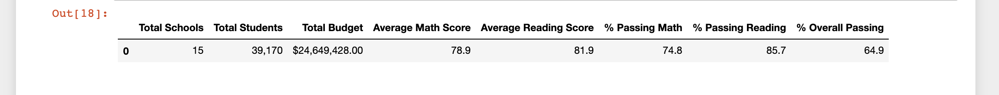


##### How does replacing the ninth graders’ math and reading scores affect Thomas High School’s performance relative to the other schools?

Replacing the ninth graders' math and reading scores did not affect Thomas High School overall performance relative to other schools.

Below is a screenshot of the summaries per school before the replacement:

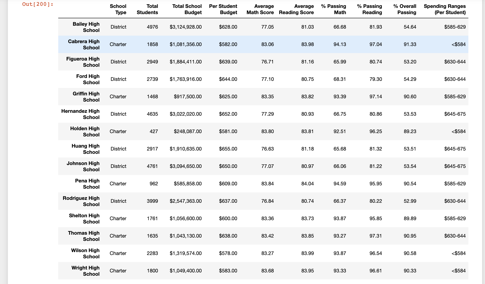


This is what the summary looked like after replacing the grades:

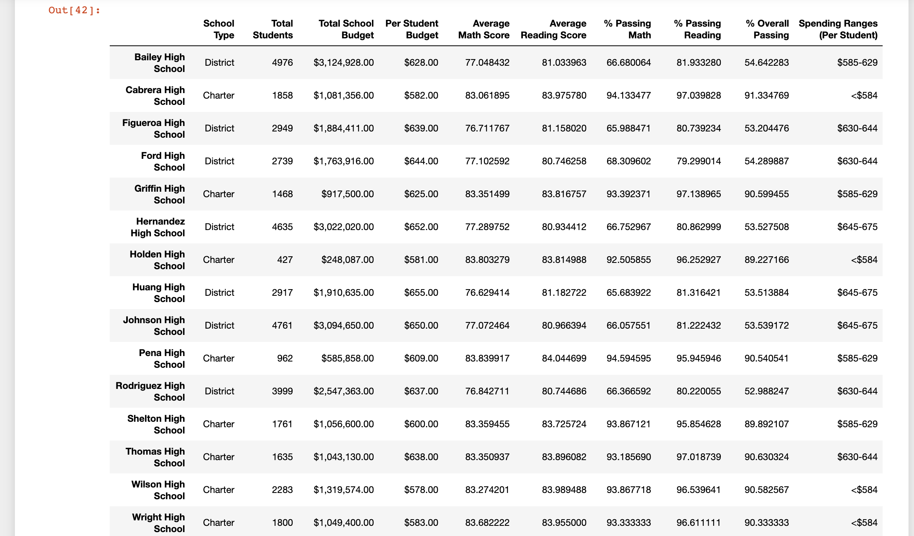


##### How does replacing the ninth-grade scores affect the following:

- Math and reading scores by grade: The math and reading scores are replaced as NaNs for the 9th grade. Those values do not affect other grades.

  Screenshot of initial Math Scores by grade:

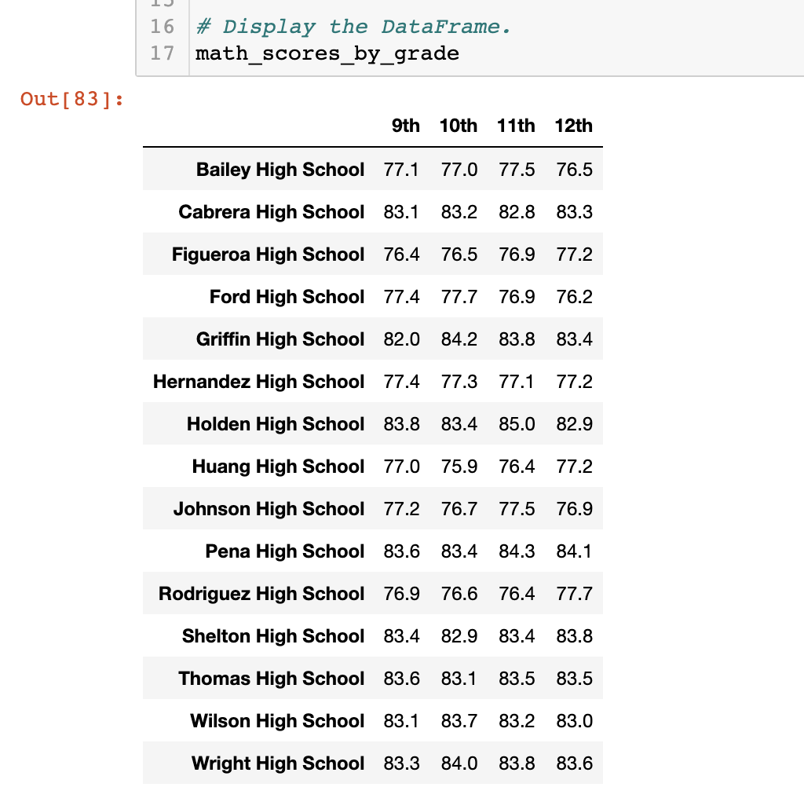

​		Screenshot of Math Scores by grade after replacement:

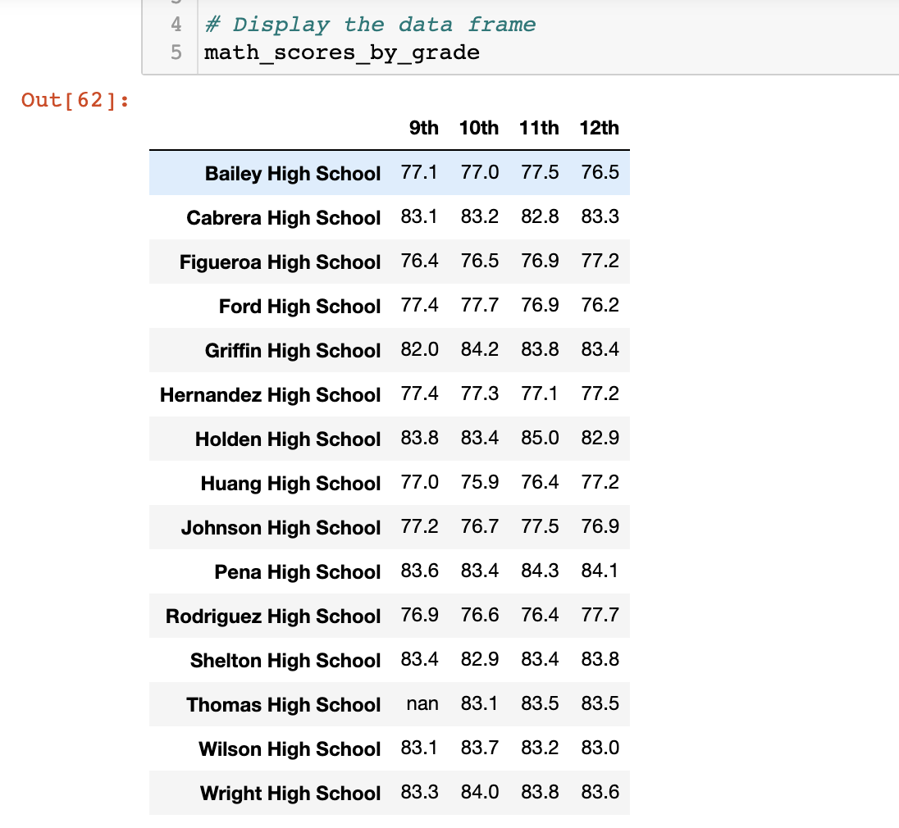


​		Screenshot of initial Reading Scores by grade:

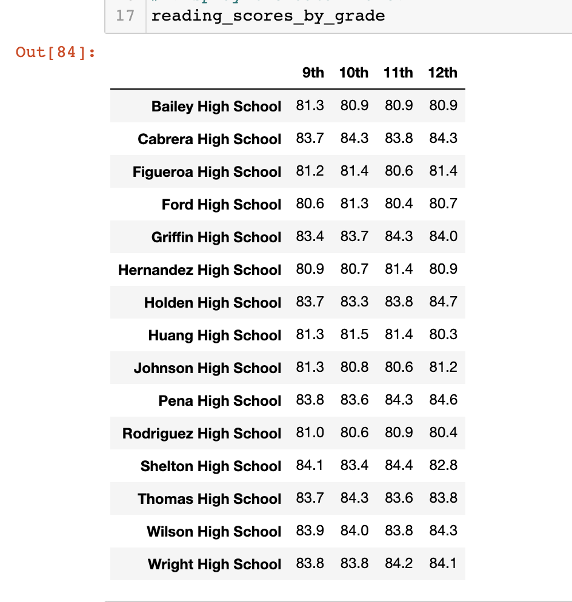


​		Screenshot of Reading Scores by grade after replacement:

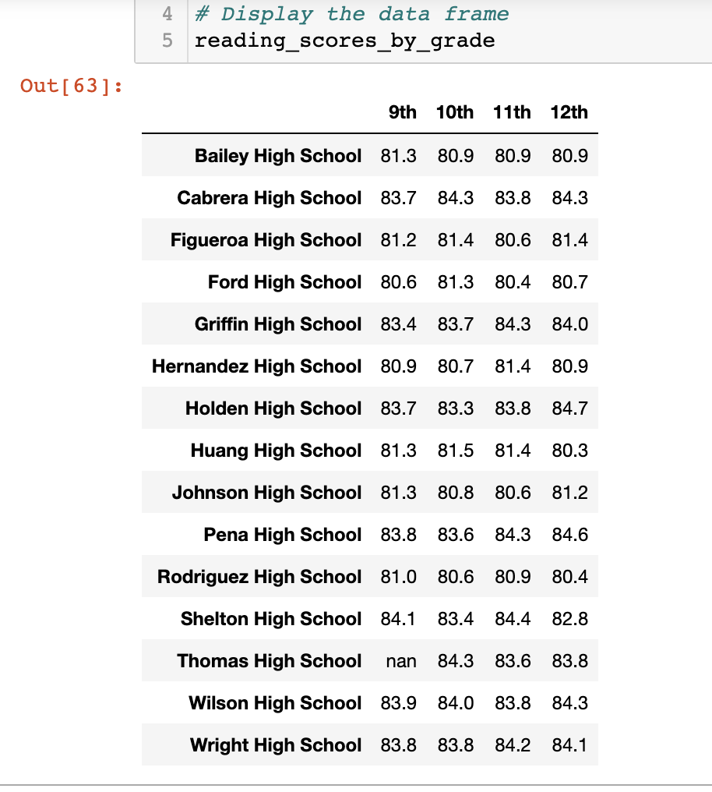


- Scores by school spending: These data frames remained the same before and after the replacement.

  - This is a screenshot of the Scores by school spending before the replacement:

    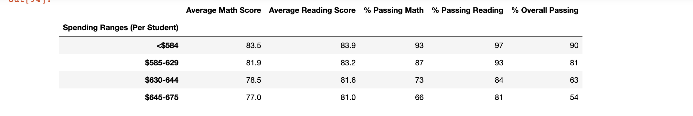

  - Screenshot of Scores by school spending after replacement:

    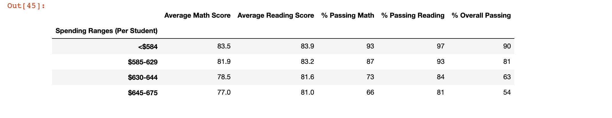

- Scores by school size: These data frames remained the same before and after the replacement.

  - This is a screenshot of the Scores by school size before the replacement:

    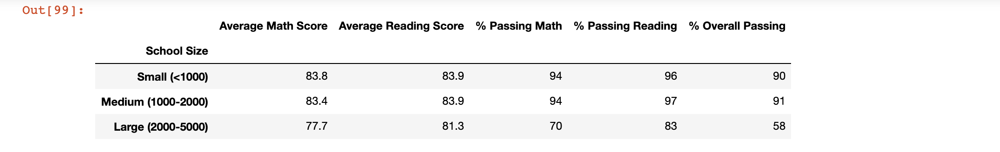

  - Screenshot of Scores by school size after replacement:

    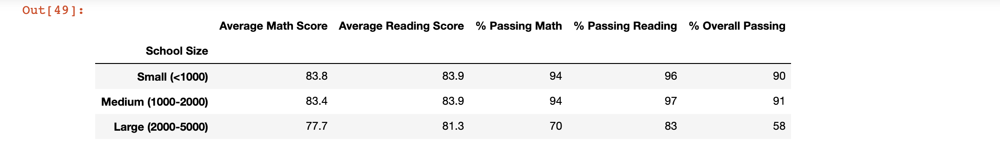

- Scores by school type: These data frames remained the same before and after the replacement.

  - This is a screenshot of the Scores by school type before the replacement:

    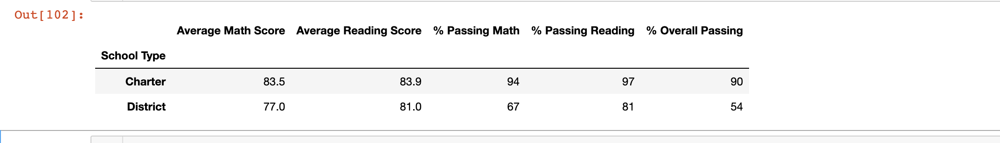

  - Screenshot of Scores by school type after replacement:

    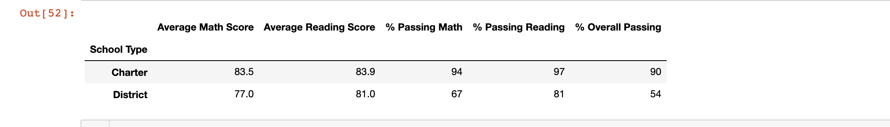


## **Summary** 

After Math and Reading scores of the ninth grade at Thomas High School have been replaced by NaNs, our Math and Reading scores by grade data frames are incomplete - ninth grade values are not present. The specific passing grade percentages in Math and Reading performances for Thomas High School lowered almost insignificantly, as did its overall passing percentages.

Relative to other schools, Thomas High School performance summaries were not affected. Similarly, in the analysis of scores per School Spending, School Size and School Type, the replacement did not affect the results.


